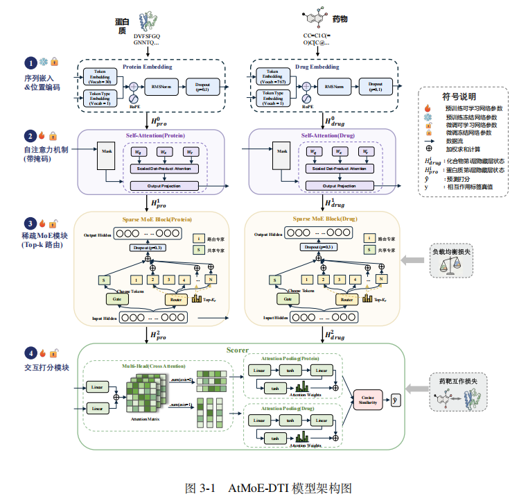
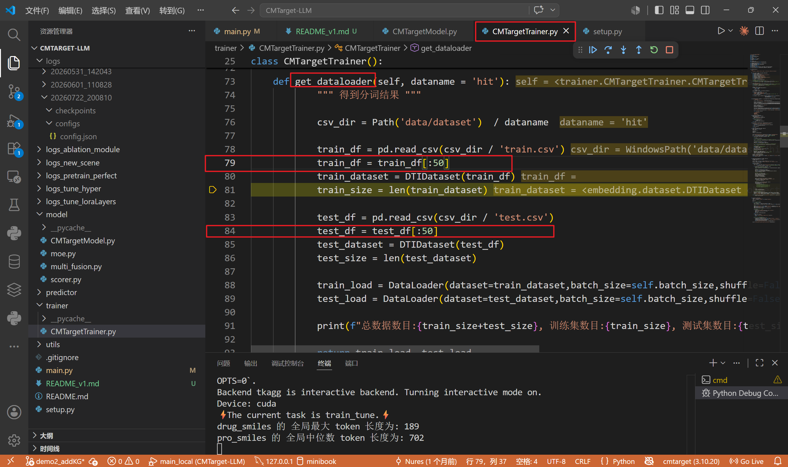

## 1. AtMoE模型

- 关键词：迁移学习，中药DTI，DTI，预训练-微调，注意力机制，Qwen2.5混合专家，交互注意力

- 模型架构图：



## 2. 代码介绍

### 2.1 已用文件夹

```
data/dataset：数据集文件夹
	data/hit/hit.csv：全量数据集
	data/hit/train.csv：训练集
	data/hit/test.csv：测试集
embedding/：特征预提取、数据集封装
	ProBert/：在网络上下载 ProBert 模型到本地
	ChemBerta/：在网络上下载 ChemBerta 模型到本地
	dataset.py：模型图中的第一模块，序列嵌入&位置编码（这里采用 Bert 模型的词表进行‘序列转数字id’）
fineTuner/：微调阶段
	FineTunner.py：微调阶段代码
		get_dataloader函数：加载csv数据集，并提取序列特征
		get_model函数：加载模型，定义模型的哪些层冻结、哪些进行低秩训练
		get_loss函数：
		model_train_anepoch函数：训练集训练
		model_evaluate_anepoch函数：测试集测试
		fineTune函数：整个微调阶段的流程封装
logs/：过程记录，初始时需创建一个空logs文件夹
model/：模型定义
	CMTargetModel.py：模型整体封装、模型训练过程
	moe.py、multi_fusion.py、scorer.py：模型的第2-4模块	
trainer/：预训练阶段
	CMTargetTrainer.py：和 FineTunner.py 基本一致
utils/：其它配置
	metrix.py：计算评价指标
	utils.py：
		MultiTaskLossWrapper函数：自动学习损失函数的权重参数（可训练）
main.py：模型运行入口，定义运行参数、模型参数等。
setup.py：模型运行所需环境
```

### 2.2 未用文件夹

```bash
embedding/：特征预提取、数据集封装
	word2vec_30.model：下载的word2vec模型
	word2vec.py：使用word2vec模型提取特征
predictor/：关系预测阶段（未完成）
utils/pyproject.toml：（废弃）
```

### 2.3 ProBert模型下载使用方法

```bash
# 在服务器上使用, 先下载, 再使用下面这段代码加载模型
export HF_ENDPOINT="https://hf-mirror.com"
huggingface-cli download --resume-download seyonec/ChemBERTa-zinc-base-v1 --local-dir ./embedding/ChemBERTa
huggingface-cli download --resume-download Rostlab/prot_bert --local-dir ./embedding/ProBert
```


## 3. 小样本快速运行
### 3.1 说明

- 预训练阶段和微调阶段：训练集、测试集各取50条数据（在 get_dataloader函数 可以看到）。



### 3.2 环境配置

创建虚拟环境后，运行：

```bash
conda create -n cmtarget python=3.10
conda activate cmtarget
pip install -e .
```

### 3.3 运行

```bash
python main.py
```


## 4. 数据集介绍

```
数据集链接: https://pan.baidu.com/s/103TiEI-UkiLfH8DZ5OaiJw?pwd=tusp 提取码: tusp 
```

- drugbank 数据集：
  - 总样本数: 37283
  - 训练集大小: 29826 (80%)
  - 测试集大小: 7457 (20%)

- HIT2.0 数据集：
  - 总样本数: 4499
  - 训练集大小: 3599 (80%)
  - 测试集大小: 900 (20%)

- DTI2 数据集：
  - 总样本数: 62490
  - 训练集大小: 49992 (80%)
  - 测试集大小: 12498 (20%)


