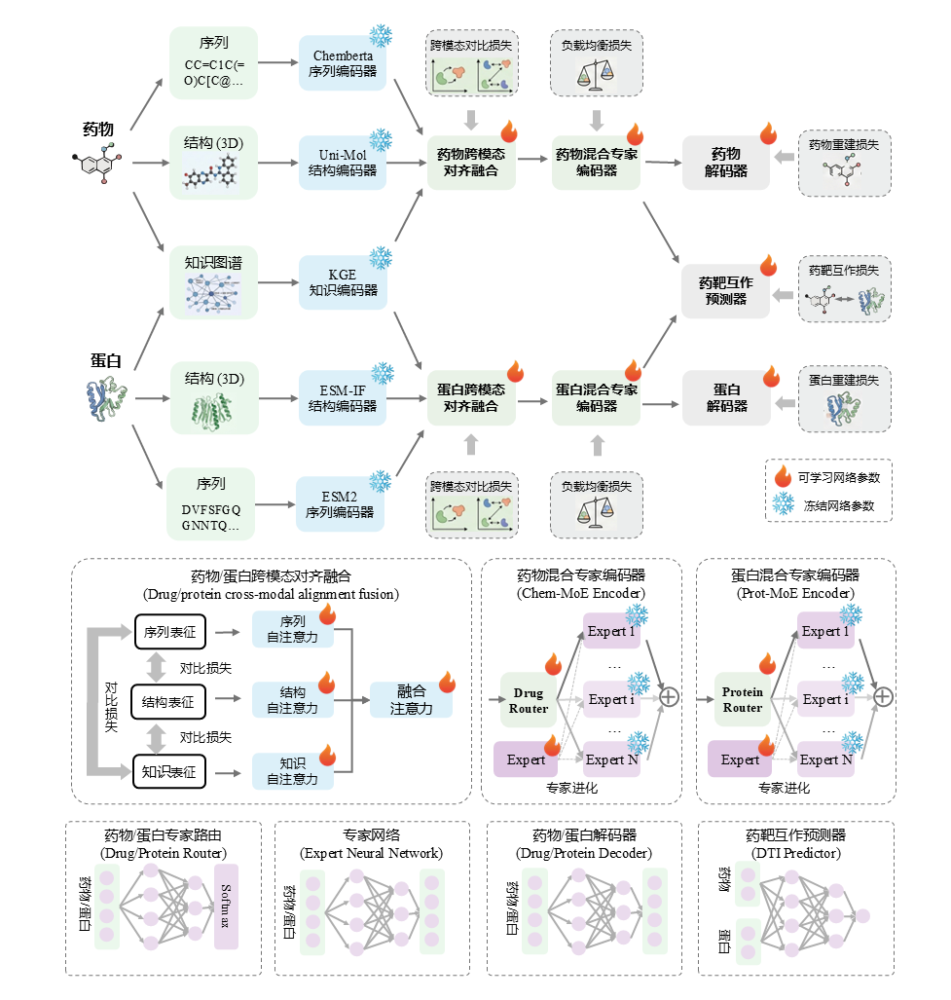
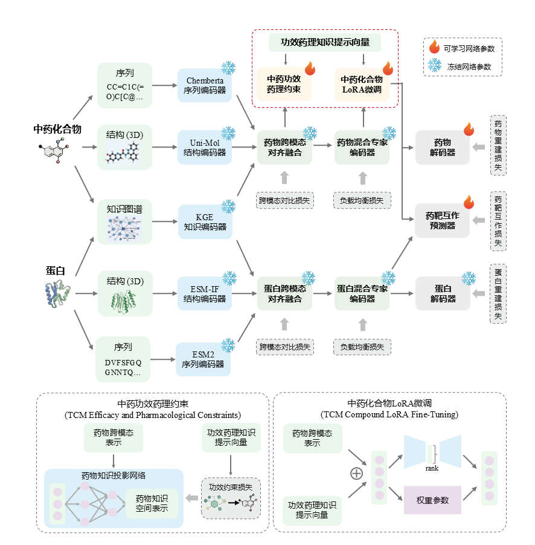

# Model

## MOE模块
### 看百度MOE

https://github.com/huggingface/transformers/blob/c368e139aade3ee7cdfa29387f3249168a912e5c/src/transformers/models/ernie4_5_moe/modeling_ernie4_5_moe.py#L355

###  负载均衡损失原理

负载均衡损失：$L_{moe}=E * ∑_{i=1}^E f_i^2$

其中：

- E 是专家数量
- $f_i$ 是第 i 个专家的平均分配概率

希望：每个专家被选中的概率尽可能平均。理想状况下，$f_i = 1/E$，此时Loss=1，为最小值。

## 特征融合模块

### 对比损失计算方案

对比损失时应该计算样本级余弦相似度还是token级余弦相似度

```python
        # 计算样本级余弦相似度    
        z_i_pool = z_i.mean(dim=1)   # [B, D]
        z_j_pool = z_j.mean(dim=1)   # [B, D]
        sim_matrix = F.cosine_similarity(z_i_pool.unsqueeze(1), z_j_pool.unsqueeze(0), dim=-1) #(batch_size, batch_size)
        # 计算token级余弦相似度  
        # sim_matrix = F.cosine_similarity(
        #     z_i.unsqueeze(2),   # [B, T, 1, D]
        #     z_j.unsqueeze(1),   # [B, 1, T, D]
        #     dim=-1
        # )  #[2, 501, 501]
```

- 答案：计算样本级余弦相似度才对，应为后边要和样本的labels比较，得到bce损失的~

## 打分器模块

# Embedding

## 关于输入的特征对齐方式

更好的替代方案？如果你觉得插值法效果不佳，可以考虑以下更符合 Transformer 逻辑的方法：

- Adaptive Average Pooling (自适应平均池化)：torch.nn.AdaptiveAvgPool1d(target_size)。这在保留全局信息方面通常比单纯的线性插值更鲁棒。
  注意：需要先将维度转置为 $[B, C, N]$。

- Learnable Resampling (可学习重采样)：引入一个固定长度的 Query（如一组 Latent Tokens），通过 Cross-Attention 去原序列中提取信息。这是 Perceiver IO 等模型的核心思想。

- Global Attention Pooling：通过一个线性层计算每个 Token 的权重，加权求和得到固定维度的表示，而不是硬性缩放。

总结建议如果你的 $N$ 维度代表的是空间或时间上的连续信号（如图像块、语音帧），你可以放心使用 interpolate。但如果 $N$ 维度是语言单词，建议优先使用 Padding/Truncate（补齐/截断）。如果必须缩放，请确保在插值后检查模型是否还能正确识别序列的边界。

### 化合物特征对齐问题

**问题：**

- 每个batch得到的embedding：[batch_size, token_num, tensor]

- [8, 72, 768], [8, 83, 768] 

- 即，每个batch嵌入的token数目不同

```python
# 解决方案1：
# 线性插值法, 将每个batch内部的 drug_tensor 对齐.
# 即 : 把token_num维度强制成128

# drugs_tensor = pad_sequence(drugs, batch_first=True, padding_value=0.0)
x = drugs.permute(0, 2, 1)  # 先把 768 维移到中间: [batch, 768, token_num]
x_resized = torch.nn.functional.interpolate(x, size=128, mode='linear', align_corners=False)
x_resized = x_resized.permute(0, 2, 1)  # 再换回来
return x_resized  #[16, 128, 768])  # [8,128,768]
```

- Q1：只要我的每个batch对齐，那我训练时也用同样的batch，可以吗？
  - A1：好像不太稳定【不可以】。
  - T1：那我就必须所有数据全部token对齐了。

```python
# 解决方案2：【最终】
# 获取所有化合物序列的最大token数量
d_max_tokenLen = feature_extractor.get_chemberta_max_length(df['compound'].tolist()) #222


def get_chemberta_max_length(self, all_drug_smiles):
    all_inputs = self.drug_tokenizer(all_drug_smiles, truncation=True)
    # 获取所有编码后的input_ids的长度，取最大值
    max_druglen_all = max([len(x) for x in all_inputs['input_ids']])
    print(f"全局 drug_smiles 最大 token 长度为: {max_druglen_all}")

    return max_druglen_all
```

### 蛋白质特征对齐问题

**问题：**

- 蛋白质序列长度不同，因此氨基酸数量不同

**解决：**

- 方案一：先提前获取所有蛋白质序列的氨基酸长度，p_max_kmers，然后所有vec都padding到p_max_kmers。


### 对齐运行结果-V0

**hit数据集：**

```bash
(cmtarget) D:\Workplace\CMTarget-LLM>python feature_save_hf.py
Loading Word2Vec model...
Loading ChemBERTa model...
drug_smiles 的 全局最大 token 长度为: 222
protein序列 的 全局平均 氨基酸 数量为: 619
Feature Extracting: 100%|█████████████████████████████████████████████████████| 113/113 [00:07<00:00, 15.62it/s]
✅ 特征保存完成：data\encoder\hit\encoder_20pct.h5 | 总计: 904 条数据
```

**drugbank数据集：**

```
(cmtarget) D:\Workplace\CMTarget-LLM>python feature_save_hf.py
Loading Word2Vec model...
Loading ChemBERTa model...
drug_smiles 的 全局最大 token 长度为: 512
protein序列 的 全局平均 氨基酸 数量为: 540
Feature Extracting: 100%|███████████████████████████████████████████████████████████████████| 3729/3729 [07:44<00:00,  8.03it/s] 
✅ 特征保存完成：data\encoder\drugbank\encoder_80pct.h5 | 总计: 29832 条数据
drug_smiles 的 全局最大 token 长度为: 512
protein序列 的 全局平均 氨基酸 数量为: 550
Feature Extracting: 100%|█████████████████████████████████████████████████████████████████████| 933/933 [01:56<00:00,  8.00it/s]
✅ 特征保存完成：data\encoder\drugbank\encoder_20pct.h5 | 总计: 7464 条数据
```


### 长度统计

- Drgugbank

```
80pct
drug_smiles 的 全局最大 token 长度为: 512
protein序列 的 全局平均 氨基酸 数量为: 540
protein序列 的 全局最大 氨基酸 数量为: 14505
20pct
drug_smiles 的 全局最大 token 长度为: 512
protein序列 的 全局平均 氨基酸 数量为: 550
protein序列 的 全局最大 氨基酸 数量为: 14505
```

- hit

```
80pct
drug_smiles 的 全局最大 token 长度为: 222
protein序列 的 全局平均 氨基酸 数量为: 633
protein序列 的 全局最大 氨基酸 数量为: 5652
20pct
drug_smiles 的 全局最大 token 长度为: 222
protein序列 的 全局平均 氨基酸 数量为: 619
protein序列 的 全局最大 氨基酸 数量为: 4488
```

- DTI2

```
80pct
drug_smiles 的 全局最大 token 长度为: 512
protein序列 的 全局平均 氨基酸 数量为: 618
protein序列 的 全局最大 氨基酸 数量为: 5036

20pct
drug_smiles 的 全局最大 token 长度为: 512
protein序列 的 全局平均 氨基酸 数量为: 620
protein序列 的 全局最大 氨基酸 数量为: 5036
```

### 长度选择结果

- protein：1024

- drug：512

```
DrugBank
3792条数据
化合物：512tk * 768 * 4 * 3792
蛋白质：1024tk * 100 * 4 * 3792
标签：3792 * 4 
7G
55G
```

```
3792条数据，
蛋白质嵌入维度1024，protoken_len=768
化合物嵌入维度768，drugtoken_len=100

浮点数存储，
计算所需的存储空间

```


## chemberta-embedding

chemberta 的cls_embedding 使用第一层的embedding，还是last_state


## 特征对齐问题

主函数调用dataloader直接encoder所有数据然后存储下来：【失败】

- 因为每个蛋白质序列的token数目不同，使用pad方法将所有batch的蛋白质token长度对齐，感觉 不太好。
- 最终：直接在训练时encoder,浪费点时间也就算了【在CMTargetTrainer中添加encoder】


## BCE损失


## Encoder、Embdding、Forward、Inference区别

- Encoder：序列→token_id

- Embdding：token_id→连续向量
- Forward：每个 `nn.Module` 都必须有def forward(self, x):
- Inference（推理）：模型不更新参数、不反向传播、只做预测，就叫推理。


```
def train(self):
        train_dataloader, test_dataloader = self.dataloader
        max_f1 = 0
        
        for i in range(self.epochs):
            loss = self.train_model(self.model, train_dataloader, i)
```


## 其它
时间戳

```python
from datetime import datetime

# 生成格式：年 月 日 _ 时 分 秒
timestamp = datetime.now().strftime("%Y%m%d_%H%M%S")
config['timestamp'] = timestamp
print(timestamp)  # 输出示例: 20260304_180521
```


# 模型图

1. 预训练



2. 微调



# dustbin

```
3.17待办，给pretrain_test添加loss分析
```

✅❌

| 任务待办                           |      |
| ---------------------------------- | ---- |
| ❌把predictor写一下                 |      |
| ❌把特征提取encoder放到dataloader里 |      |
|                                    |      |

## 任务待办

```
1.把特征提取放到dataloader，模型调用时get_dataloader()，就能直接调用特征向量。
2.模型调用时dataloader时，只能得到文本序列，训练时encoder成特征向量
从性能和封装的角度聊聊哪个更好
```

**重复计算：** 如果训练 100 个 Epoch，方案 B 就会把同样的文本重复编码 100 次，这在算力资源紧张时是巨大的浪费。

建议一：对于“静态特征”，选方案 A

如果你的特征提取逻辑是**不可学习的**（例如：TF-IDF 向量、手动提取的统计特征、或者已经冻结参数的预训练模型输出），请务必放在 DataLoader 中甚至直接离线存入数据库/硬盘。

建议二：对于“可学习特征”，选方案 B

如果特征提取部分（如 Embedding 层、CNN/RNN Encoder）需要随损失函数**同步更新参数**，则必须放在模型内部。


```python
    def drug_fea_extract_chemberta(self, drug_sequence):
        """
        提取一个batch化合物序列的特征编码tensor

        输入：
            drug序列list : [batch_size, ]个 list of SMILES
        输出：
            drug序列的张量嵌入list : [batch_size, token_num, Hidden_Size]
        """
        # padding pad_to_max_length
        inputs = self.drug_tokenizer(drug_sequence, return_tensors="pt", 
                                     padding=True, truncation=True).to(self.device) # [2, 43] 两条数据，都是43个token_id
        
        with torch.no_grad():
            outputs = self.drug_model(**inputs) # [2, 43, 78], 每个token被编码为长度为78的tensor
        
        # 结果转回 CPU 释放显存   # outputs.pooler_output [2,768]
        drugs = outputs.last_hidden_state.cpu() #[8, 72, 768], [8, 83, 768] 
        
        return drugs 
```


```python
    # TransformerCPI-Kinase：把蛋白质序列分成若干个氨基酸 
    def seq_to_kmers(self, seq, k=3):
        """ Divide a string into a list of kmers strings.

        Parameters:
            seq (string)
            k (int), default 3
        Returns:
            List containing a list of kmers.
        """
        N = len(seq)
        return [seq[i:i+k] for i in range(N - k + 1)]
    
```


## 模型运行问题

```bash
✅preTraining finished, model has been saved to logs\20260331_220922\checkpoints\pretrain.pt
trainable params: 16,400 || all params: 12,231,839 || trainable%: 0.1341
Traceback (most recent call last):
  File "D:\Workplace\CMTarget-LLM\main.py", line 120, in <module>
    fineTunner = FineTunner(configs, configs['target_name'], configs['model_path'])#model
  File "D:\Workplace\CMTarget-LLM\fineTuner\FineTunner.py", line 51, in __init__
    self.train_loader = self.get_dataloader(train_encoder_path)
  File "D:\Workplace\CMTarget-LLM\fineTuner\FineTunner.py", line 67, in get_dataloader
    checkpoint = torch.load(train_encoder_path)
  File "D:\Application\Anaconda3\envs\cmtarget\lib\site-packages\torch\serialization.py", line 1553, in load
    raise pickle.UnpicklingError(_get_wo_message(str(e))) from None
_pickle.UnpicklingError: Weights only load failed. In PyTorch 2.6, we changed the default value of the `weights_only` argument in `torch.load` from `False` to `True`. Re-running `torch.load` with `weights_only` set to `False` will likely succeed, but it can result in arbitrary code execution. Do it only if you got the file from a trusted source.
Please file an issue with the following so that we can make `weights_only=True` compatible with your use case: WeightsUnpickler error: Unsupported operand 72

Check the documentation of torch.load to learn more about types accepted by default with weights_only https://pytorch.org/docs/stable/generated/torch.load.html.

```


rm -rf **/checkpoints/*
